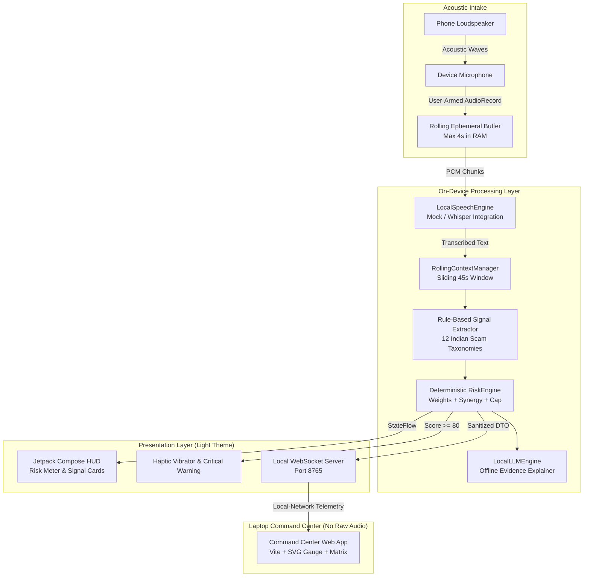

# ScamShield
## Privacy-First On-Device Scam Detection for Suspicious Calls

> *"Your phone's private safety layer for suspicious calls."*

[](https://developer.android.com)
[](./docs/PRIVACY.md)
[](./dashboard/)
[](./docs/ANDROID_LIMITATIONS.md)

ScamShield is an **on-demand consumer safety layer** engineered to protect Indian mobile users from coercive extortion tactics—especially the nationwide **"Digital Arrest"** epidemic, fake CBI/Police/Customs intimidation, and emergency bank transfer scams.

---

## 1. Technical Honesty & Capability Classification

To ensure complete transparency during hackathon evaluation, ScamShield explicitly categorizes its subsystem capabilities:

### ✅ IMPLEMENTED (Fully Functional in Prototype):
- **Light-Theme Consumer Safety UI**: Complete Jetpack Compose implementation adhering to modern fintech/safety aesthetics across 12 screens.
- **Privacy State Machine**: Bounded lifecycle (`OFF` $\rightarrow$ `REQUESTING_PERMISSION` $\rightarrow$ `ACTIVE` $\rightarrow$ `STOPPED` $\rightarrow$ `PURGED`).
- **On-Demand Microphone Capture**: Audio captured via `AudioRecord` (16 kHz, 16-bit PCM mono) strictly during active protection.
- **Acoustic Speakerphone Capture**: Honest Android call audio intake model avoiding root or accessibility abuse.
- **Rule-Based Scam Signal Extraction**: Deterministic lexical & pattern matching for 12 Indian cyber fraud tactics in English, Hindi, and Hinglish.
- **Explainable Risk Engine**: Non-linear heuristic scoring with diminishing returns, multi-vector synergy, and a strict 0–100 cap.
- **Deterministic Demo Mode**: Guaranteed 2-person scam simulation (Digital Arrest CBI, Hindi Police, Bank KYC) with natural risk escalation.
- **Local WebSocket Companion Telemetry**: Real-time broadcast of numeric risk scores and detected tactic enums to the laptop Command Center without raw audio.
- **Right to Oblivion**: One-tap session deletion clearing application-owned memory buffers and risk histories.
- **Comprehensive Test Suite**: 23 automated unit tests verifying risk math, signal extraction, false positive rejection, and privacy guarantees.

### 🔌 INTEGRATION-READY (Architected Interfaces with Open-Source Adapters):
- **Whisper Speech-to-Text**: [WhisperSpeechEngine.kt](file:///c:/Users/Ck%20Sri%20Hari/Documents/iqoo2/android/core/src/main/kotlin/com/scamshield/core/ai/stt/WhisperSpeechEngine.kt) designed to link `whisper.cpp` via Android NDK for offline incremental transcription.
- **Qwen Local LLM**: [QwenLocalLLMEngine.kt](file:///c:/Users/Ck%20Sri%20Hari/Documents/iqoo2/android/core/src/main/kotlin/com/scamshield/core/ai/llm/QwenLocalLLMEngine.kt) designed to execute `Qwen2.5-1.5B-Instruct` (GGUF Q4_K_M) via `llama.cpp` for natural-language evidence explanation.
- **On-Device OCR**: Text-input pipeline ready to bind with Google ML Kit on-device Text Recognition for physical scam letters.

### ⚡ DEMO SIMULATION (Transparently Labeled):
- **Canned Scam Scripts**: In Demo Mode or development fallback, deterministic transcript segments are labeled with a clear **DEMO SIMULATION** badge.
- **Prototype Hang-Up Action**: The "End Call" button is marked as a *Prototype action* since ordinary Android apps cannot unilaterally terminate active telephony calls without telecom carrier privileges.

---

## 2. Android Call-Audio Reality

A standard third-party Android application **cannot freely capture cellular phone-call internal audio**. 

For technical details, see [docs/ANDROID_LIMITATIONS.md](./docs/ANDROID_LIMITATIONS.md).

### Prototype Approach:
```
Caller Voice 
     ↓
Phone Speakerphone
     ↓
Acoustic Sound Waves
     ↓
Device Microphone (AudioRecord)
     ↓
ScamShield In-Memory Processing
```

The user must engage speakerphone during a suspicious call. Every relevant screen clearly notes:
> *"Speakerphone required for prototype call analysis."*

---

## 3. Architecture



---

## 4. The 12 Indian Scam Signal Taxonomies

1. **`AUTHORITY_IMPERSONATION` (+20)**: CBI, Cyber Crime Department, Crime Branch, Customs, ED, NCB.
2. **`POLICE_CBI_RBI_IMPERSONATION` (+20)**: Senior Inspector, SHO, Delhi/Mumbai Police.
3. **`LEGAL_THREAT` (+20)**: Non-bailable arrest warrant, PMLA court summons, FIR lodging, police raid threat.
4. **`IDENTITY_DOCUMENT_THREAT` (+15)**: Aadhaar card or PAN misuse accusations, drugs found in intercepted parcels.
5. **`SECRECY` (+15)**: *"Do not tell anyone"*, *"Kisi ko mat batana"*, *"Confidential national security matter"*.
6. **`VIDEO_CONFINEMENT` (+15)**: *"Stay on video call"*, *"Video call mat cut karna"*, *"Keep camera on"* (Digital Arrest).
7. **`FINANCIAL_REQUEST` (+30)**: Demands to transfer money, security deposits, clearance penalties.
8. **`SAFE_ACCOUNT_SCAM` (+25)**: Coercion to move funds into a *"safe RBI verification account"*.
9. **`CREDENTIAL_REQUEST` (+30)**: Harvesting OTPs, UPI PINs, ATM PINs, net banking passwords.
10. **`REMOTE_ACCESS_REQUEST` (+25)**: AnyDesk, TeamViewer, QuickSupport screen takeover requests.
11. **`URGENCY` (+10)**: *"Within 10 minutes"*, *"Turant abhi ke abhi"*, *"Last chance before arrest"*.
12. **`PAYMENT_LINK` (+20)**: QR code scanning, malicious payment collect links.

---

## 5. Risk Calculation Formula

- **Single repeated keyword diminishing returns**: $\text{Repetition Bonus} = \min(5.0, (\text{count} - 1) \times 2.5)$.
- **Multi-vector synergy bonus**: Escalates when independent tactics appear together ($+4$ for $\ge 2$, $+10$ for $\ge 3$, $+18$ for $\ge 4$, $+25$ for $\ge 5$).
- **Digital arrest composite detection**: Authority + Threat + Secrecy/Confinement + Money Demands triggers an immediate score of $\ge 92$.
- **Strictly capped at 100**.

---

## 6. Verification & Automated Test Suite

Run the unit tests via Gradle:

```powershell
.\gradle-bin\bin\gradle.bat -p android :core:test
```

### Verified Test Cases:
- `RiskEngineTest`: Step-by-step risk escalation, synergy calculation, score cap at 100.
- `ScamSignalExtractorTest`: Detection of English, Hindi, and Hinglish authority impersonation, arrest threats, coerced secrecy, and AnyDesk coercion.
- `FalsePositiveTest`: Rejection of everyday conversation (*"How are you?"*, *"Your bank branch closes at 5 PM"* remain LOW).
- `PrivacyStateTest`: Instant mic shutoff on stop, rolling buffer memory pruning, session oblivion.
- `DashboardPayloadFilterTest`: Verification that raw audio is strictly excluded and transcripts require explicit opt-in.

---

## 7. Running the Laptop Command Center

```bash
cd dashboard
npm run dev   # launches on http://localhost:5173
```

Open `http://localhost:5173` in any browser to observe real-time risk scores and tactical event logs.
