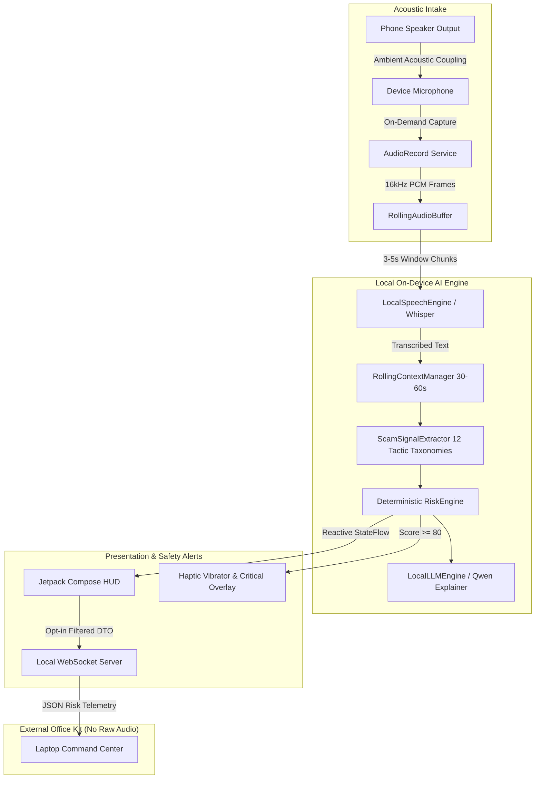

# ScamShield Technical Architecture

ScamShield implements a clean, layered architecture separating core scam reasoning and privacy contracts from Android UI and hardware drivers.

---

## Module Breakdown

### 1. Domain Layer (`domain/`)
- **`model/ScamSignal`**: Evidence dataclass with ID, type taxonomy, confidence score, severity weight, matched snippet, and timestamp.
- **`model/RiskScore`**: Aggregate risk assessment containing score (0-100), confidence multiplier, level (`LOW`, `SUSPICIOUS`, `HIGH`, `CRITICAL`), active signals, and explainable summary.
- **`model/PrivacyState`**: Formal state machine tracking mic status, buffer allocation, network isolation, and export privileges.

### 2. Signal Extraction Engine (`ai/signal/`)
Implements rule-based and semantic pattern matchers tailored to Indian cyber crime syndicates:
- Digital arrest schemes (fake CBI / Police / Enforcement Directorate / Customs / Supreme Court).
- Aadhaar / PAN illegal shipment linkage threats.
- Video call isolation & confinement ("do not cut call", "keep camera on").
- Safe account transfer scams ("move funds to RBI verification account").
- Remote desktop takeover (AnyDesk, QuickSupport, TeamViewer).
- Credential harvesting (OTP, UPI PIN, ATM PIN).
- Multilingual and Hinglish lexicons.

### 3. Explainable Risk Engine (`ai/risk/`)
- Heuristic weighted accumulator with asymptotic ceiling (Max: 100).
- Temporal persistence: filters out transient false-positives (e.g. casual mention of "bank") by demanding multiple independent tactical vectors across a time window.
- Confidence scaling: increases with corroborating evidence.

### 4. Audio & Privacy Layer (`audio/`, `privacy/`)
- Zero-disk ephemeral buffer (`RollingAudioBuffer`).
- Strict lifecycle binds microphone hardware activation to the user's explicit foreground UI intent.
- Synchronous destruction upon `STOP_PROTECTION`.

### 5. Network & Companion Protocol (`network/`)
- Embedded lightweight WebSocket server (`port 8765`).
- Telemetry payload sanitizer strips all PII and acoustic data.
